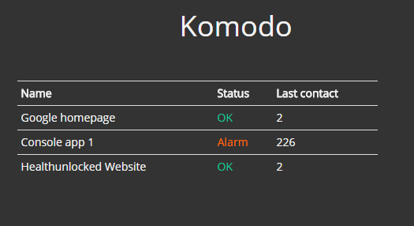

# KOMODO

Simple monitoring services.  
Can monitor http and daemon services.  
Result of a simple code golf.

### To Run

Clone the repo, open the solution in Visual Studio, run.

### Endpoints

**1. Status endpoint** 

*url:* `/home/status`
*method:* `GET`  

Gets status of currently monitored services

Sample response: 

	{  
	   "payload":[  
	      {  
	         "Name":"Google homepage",
	         "Status":"OK",
	         "LastSeen":68
	      },
	      {  
	         "Name":"Console app 1",
	         "Status":"OK",
	         "LastSeen":94
	      },
	      {  
	         "Name":"Healthunlocked Website",
	         "Status":"Alarm",
	         "LastSeen":138
	      }
	   ]
	}

**2. Update service endpoint**

*url:* `/home/status?id={id}`    
*method:* `PUT`    
*note:* `id is required; type: string`  

Updates the `last_contact` of the service given by `string` `id`

### Adding new services to monitor

Configuration file is located at `/Content/config.json` ([here](MiniHubble/Content/config.json)). Add a new entry in the format: 

	{
	    "id": "healthunlocked",
	    "type": "web",
	    "name": "Healthunlocked Website",
	    "alert": 100,
	    "url": "https://healthunlocked.com"
	}

and it should be picked up on next restart  

### Ping mechanism

So how does the regular pings work? 
For all the `type:web` services, Komodo pings them at regular intervals and looks for `status:200` from the header.  
This is done with the help of [Cache expiration handler](http://blog.stackoverflow.com/2008/07/easy-background-tasks-in-aspnet/).  

* Add something to cache with expiration time and expiration handler set
* When it expires, the handler is called. Perform necessary task there
* go to step 1.
